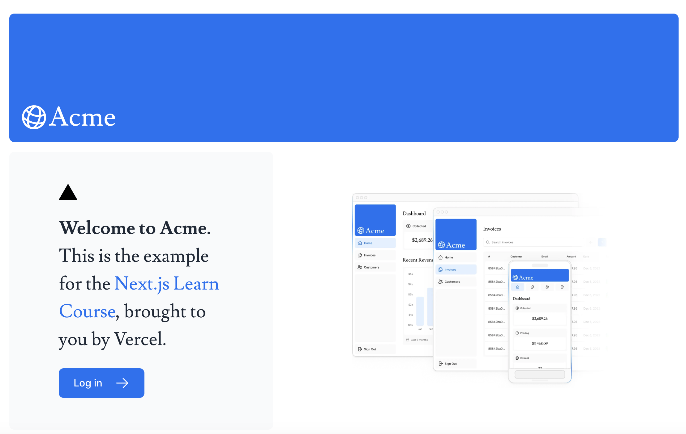

## Next.js App Router Course - Starter

## 📝 Next.js Admin Dashboard
Welcome to the Next.js Admin Dashboard, an application I built as part of the Next.js Dashboard App course. This dashboard allows users 
to manage customers and invoices, integrating key concepts like server-side rendering, data fetching, authentication, and more.

## 🚀 What I Learned
Through this project, I gained experience in developing a comprehensive, full-stack dashboard with Next.js. Here’s a summary of the key topics covered:

## 📂 1. File-Based Routing
I learned how to build pages using Next.js’s intuitive file-based routing system. Each file in the /app directory became a page or API route, making navigation and API creation seamless.

## ⚙️ 2. Data Fetching with Server-Side Rendering (SSR) and Static Generation (SSG)
Explored both static generation and server-side rendering techniques. I used getStaticProps for pre-rendering pages at build time and getServerSideProps to fetch data at runtime when needed.

## 📑 3. Managing State and Actions
Using React Hooks like useActionState, I managed complex states in forms and performed server-side validation with libraries like Zod.
Created CRUD operations to handle customer and invoice data, making the dashboard fully functional.

## 🔐 4. Authentication and Authorization
Integrated NextAuth.js for user authentication, ensuring that only authorized users could access certain parts of the dashboard (e.g., managing invoices and customer records).

## 🎨 5. Styling with Tailwind CSS
Designed a responsive, modern UI using Tailwind CSS. I learned how to apply utility-first classes for styling various components including buttons, forms, tables, and the dashboard layout.

## 📝 6. Form Validation & Accessibility
Implemented server-side validation using Zod and displayed error messages dynamically when forms failed.
Added ARIA labels to improve accessibility, ensuring that the dashboard is user-friendly for people using screen readers.

## 🔄 7. API Routes and Database Integration
Built API routes in Next.js to handle customer and invoice creation, updates, and deletion. These routes connect to a Postgres database hosted on Vercel.

## 📊 8. Deployment to Vercel
Finally, I deployed the application to Vercel, leveraging its seamless integration with Next.js for hosting and auto-deployments.

## 🛠 Technologies Used
Next.js (15.0.0-canary.56)
TypeScript
Tailwind CSS
Zod (for validation)
NextAuth.js (for authentication)
Postgres (for database)
Vercel (for deployment)

## 📑 Project Features
Manage customers and invoices via a simple admin UI
Form validation with real-time feedback
Secure authentication and session handling
Fully responsive design with accessible elements
Data-fetching using SSR and SSG

## 🌐 Live Demo
You can check out the deployed app on Vercel.

This is the starter template for the Next.js App Router Course. It contains the starting code for the dashboard application.

For more information, see the [course curriculum](https://nextjs.org/learn) on the Next.js Website.
# Next.jsApp
